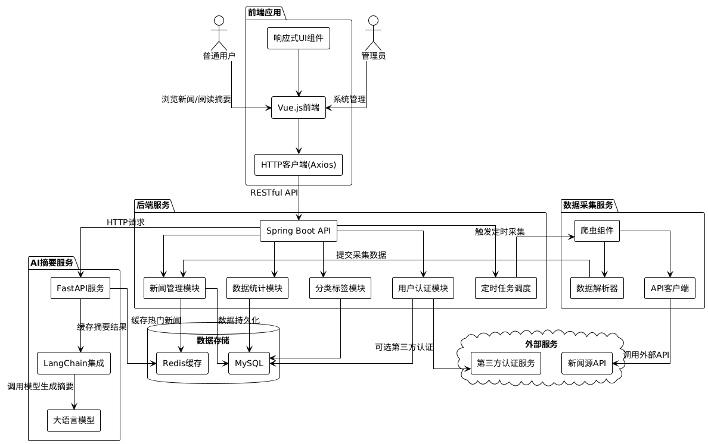

# 阿米News系统设计文档

## 1. 引言

本文档描述了阿米News系统的设计，包括软件架构、模块设计、数据库设计和用户界面设计等方面的内容。本项目旨在聚合多来源新闻数据，并借助AI技术生成新闻摘要，辅助用户快速掌握关键信息。

## 2. 软件架构

阿米News系统采用**多层架构**方式，实现前后端分离，同时将AI摘要功能独立为微服务，以保证系统的可扩展性和维护性。

### 2.1 模块划分

阿米News系统包含以下主要模块：

- **前端模块**：基于Vue.js构建的Web应用，负责用户界面展示和交互。
- **后端API模块**：基于Spring Boot构建的RESTful API服务，处理业务逻辑和数据管理。
- **AI摘要服务**：基于FastAPI构建的独立微服务，集成LangChain调用大模型生成摘要。
- **数据采集模块**：负责从多个新闻源采集数据的爬虫或API调用组件。
- **数据存储模块**：使用MySQL/PostgreSQL存储结构化数据。
- **任务调度模块**：管理定时任务，如新闻数据定时采集等。

### 2.2 模块间通信

- **前端与后端API通信**：通过HTTP/HTTPS协议，使用RESTful API进行数据交换，采用JSON格式。
- **后端API与AI摘要服务通信**：通过HTTP协议，使用RESTful API调用摘要生成服务。
- **后端API与数据库通信**：通过数据库连接池和ORM框架进行数据存取。
- **数据采集模块与后端API通信**：通过内部API或消息队列提交采集的新闻数据。

## 3. 主要软件体系结构决策

### 3.1 前后端分离架构

**设计原理**：将前端UI与后端业务逻辑分离，前端通过API调用后端服务。

**优点**：
- 技术栈解耦，前端团队和后端团队可以并行开发
- 前端可独立部署，提高开发效率
- 便于实现响应式设计，提升用户体验
- API可复用，为移动应用等其他客户端提供支持

**缺点**：
- 增加了系统复杂度
- 可能存在跨域问题
- 需要处理前后端数据交互的安全性

**折中分析**：虽然增加了一定复杂度，但前后端分离架构的灵活性和可维护性优势明显，尤其适合阿米News这类需要频繁UI更新和持续功能迭代的应用。

### 3.2 微服务架构（AI摘要服务）

**设计原理**：将AI摘要功能剥离为独立的微服务，通过API进行调用。

**优点**：
- 技术栈隔离，AI服务可使用Python生态（FastAPI、LangChain等）
- 独立扩展，可根据摘要处理需求单独调整资源
- 故障隔离，AI服务的问题不会影响核心新闻功能
- 便于优化和迭代AI模型

**缺点**：
- 增加了系统的分布式复杂性
- 服务间通信存在网络开销
- 需要考虑服务发现和负载均衡

**折中分析**：考虑到AI摘要服务有特殊的技术栈需求（Python生态）和计算资源需求，将其设计为独立微服务是合理的架构决策，虽然增加了一定的复杂性，但获得了技术栈灵活性和独立扩展能力。

### 3.3 分层架构模式

**设计原理**：在后端API服务中采用经典的分层架构模式，包括表示层、业务逻辑层、数据访问层。

**优点**：
- 关注点分离，每层负责不同职责
- 代码组织清晰，便于维护
- 有利于测试，各层可独立测试
- 提高代码复用性

**缺点**：
- 可能导致过度设计
- 增加了代码量和初始开发时间
- 层间通信可能影响性能

**折中分析**：分层架构是经典成熟的设计模式，对于功能丰富的新闻系统来说，清晰的代码组织和关注点分离带来的维护性优势远大于性能上的微小损失。

### 3.4 发布-订阅模式（事件驱动架构）

**设计原理**：采用事件驱动的方式处理新闻数据的采集、处理和摘要生成流程。

**优点**：
- 系统组件解耦，发布者不需要知道订阅者的存在
- 提高系统响应性，可异步处理耗时操作
- 便于扩展，新增处理器只需订阅相关事件
- 适合数据流处理，如新闻采集→处理→摘要生成的流程

**缺点**：
- 增加系统复杂性
- 可能引入消息一致性问题
- 调试和追踪事件流较困难

**折中分析**：考虑到新闻数据处理的异步特性（爬虫采集、AI摘要生成等耗时操作），采用事件驱动架构可以显著提高系统吞吐量和响应性，虽然增加了一定复杂度，但收益明显。

## 4. 数据库设计

阿米News系统使用关系型数据库（MySQL/PostgreSQL）存储新闻数据、用户信息和系统配置等。

### 4.1 新闻表（News）
- **字段**：新闻ID、标题、来源、发布时间、正文、分类ID、创建时间、更新时间等。
- **主键**：新闻ID。

### 4.2 摘要表（Summary）
- **字段**：摘要ID、新闻ID、摘要内容、生成时间、摘要状态等。
- **主键**：摘要ID。
- **外键**：新闻ID关联新闻表。

### 4.3 分类表（Category）
- **字段**：分类ID、分类名称、分类描述、创建时间等。
- **主键**：分类ID。

### 4.4 标签表（Tag）
- **字段**：标签ID、标签名称、创建时间等。
- **主键**：标签ID。

### 4.5 新闻标签关联表（NewsTag）
- **字段**：关联ID、新闻ID、标签ID等。
- **主键**：关联ID。
- **外键**：新闻ID关联新闻表，标签ID关联标签表。

### 4.6 用户表（User）
- **字段**：用户ID、用户名、密码（加密）、邮箱、创建时间等。
- **主键**：用户ID。

### 4.7 收藏表（Favorite）
- **字段**：收藏ID、用户ID、新闻ID、收藏时间等。
- **主键**：收藏ID。
- **外键**：用户ID关联用户表，新闻ID关联新闻表。

## 5. 用户界面设计

阿米News系统的用户界面基于Vue.js框架设计，采用响应式布局，确保在不同设备上都有良好的显示效果。

## 6. 总体流程

阿米News系统的整体流程如下：

1. 数据采集模块定时从多个新闻源采集最新新闻数据。
2. 采集的数据经过清洗和格式化，存入数据库。
3. 后端服务触发AI摘要生成请求，调用AI摘要服务。
4. AI摘要服务生成摘要内容，返回给后端并存储。
5. 用户通过前端界面浏览新闻列表、查看新闻详情和摘要。
6. 注册用户可收藏新闻、评价摘要质量。
7. 管理员可通过后台管理界面维护新闻内容、分类标签，查看系统统计信息。

## 7. 接口定义

详细描述模块之间的接口和函数调用方式，包括前端与后端API的接口，后端API与AI摘要服务的接口，以及数据采集模块的接口等。

## 7.1 后端接口设计

### 7.1.1 新闻管理接口

### 获取新闻列表
GET /api/news
参数:
  - page: 页码
  - size: 每页数量
  - category: 分类ID (可选)
  - tag: 标签ID (可选)
  - keyword: 搜索关键词 (可选)
返回:
  - total: 总条数
  - data: 新闻列表数组
    - id: 新闻ID
    - title: 标题
    - source: 来源
    - publishTime: 发布时间
    - summary: 摘要
    - category: 分类
    - tags: 标签数组

### 获取新闻详情
GET /api/news/{id}
返回:
  - id: 新闻ID
  - title: 标题
  - source: 来源
  - publishTime: 发布时间
  - content: 正文内容
  - summary: 摘要
  - category: 分类
  - tags: 标签数组

### 添加新闻 (管理员)
POST /api/admin/news
请求体:
  - title: 标题
  - source: 来源
  - publishTime: 发布时间
  - content: 正文内容
  - categoryId: 分类ID
  - tagIds: 标签ID数组

### 更新新闻 (管理员)
PUT /api/admin/news/{id}
请求体: (同添加)

### 删除新闻 (管理员)
DELETE /api/admin/news/{id}

### 7.1.2 用户认证接口

### 用户注册
POST /api/auth/register
请求体:
  - username: 用户名
  - password: 密码
  - email: 邮箱

### 用户登录
POST /api/auth/login
请求体:
  - username: 用户名
  - password: 密码
返回:
  - token: JWT令牌
  - user: 用户信息

### 获取用户信息
GET /api/user/profile
Header:
  - Authorization: Bearer {token}
返回:
  - id: 用户ID
  - username: 用户名
  - email: 邮箱
  - role: 角色

### 7.1.3 收藏管理接口

### 获取用户收藏列表
GET /api/favorites
Header:
  - Authorization: Bearer {token}
参数:
  - page: 页码
  - size: 每页数量

### 添加收藏
POST /api/favorites
Header:
  - Authorization: Bearer {token}
请求体:
  - newsId: 新闻ID

### 删除收藏
DELETE /api/favorites/{newsId}
Header:
  - Authorization: Bearer {token}

### 7.1.4 标签和分类接口

### 获取所有分类
GET /api/categories
返回:
  - 分类数组
    - id: 分类ID
    - name: 分类名称
    - description: 分类描述

### 获取所有标签
GET /api/tags
返回:
  - 标签数组
    - id: 标签ID
    - name: 标签名称

## 7.2 AI摘要服务接口

### 生成新闻摘要
POST /api/summary/generate
请求体:
  - newsId: 新闻ID
  - content: 新闻正文
  - title: 新闻标题(可选)
  - maxLength: 摘要最大长度(可选)
返回:
  - summary: 生成的摘要内容
  - status: 处理状态(success/failed)
  - processTime: 处理时间(ms)

### 批量生成新闻摘要
POST /api/summary/batch-generate
请求体:
  - newsList: 新闻数组
    - newsId: 新闻ID
    - content: 新闻正文
    - title: 新闻标题(可选)
返回:
  - results: 结果数组
    - newsId: 新闻ID
    - summary: 生成的摘要
    - status: 处理状态

## 7.3 数据采集模块接口

### 触发新闻数据采集
POST /api/admin/crawler/start
请求体:
  - source: 新闻来源(可选)
  - category: 采集分类(可选)
  - limit: 采集数量限制(可选)
返回:
  - taskId: 采集任务ID
  - status: 任务状态

### 查询采集任务状态
GET /api/admin/crawler/status/{taskId}
返回:
  - taskId: 采集任务ID
  - status: 任务状态(running/completed/failed)
  - collected: 已采集数量
  - failed: 失败数量
  - startTime: 开始时间
  - endTime: 结束时间(如已完成)

