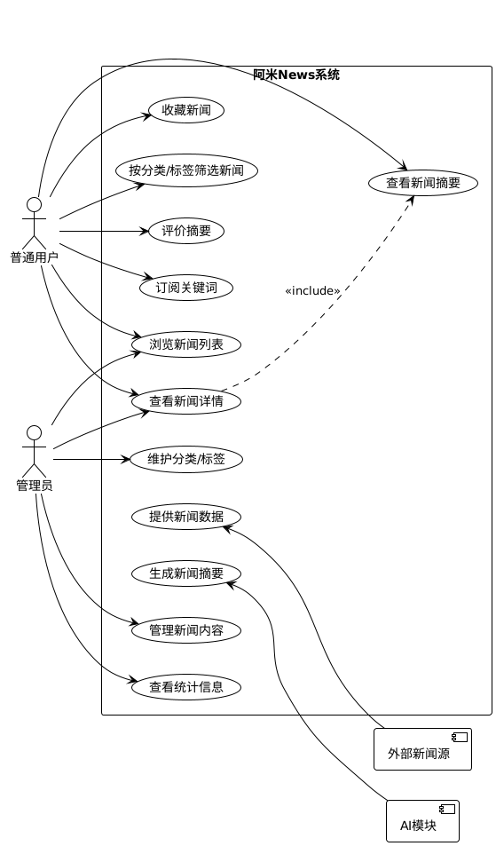
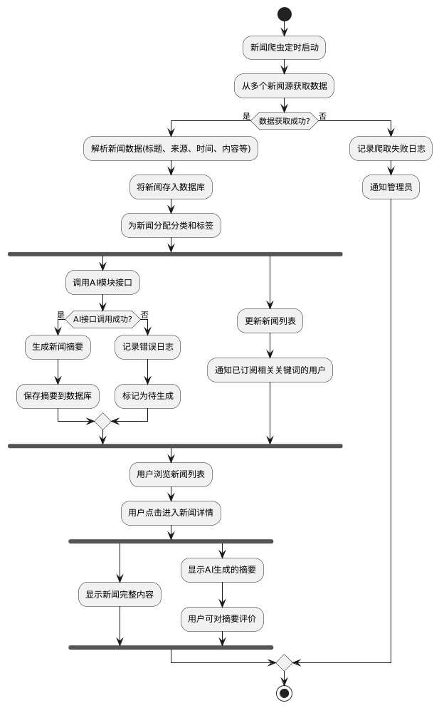
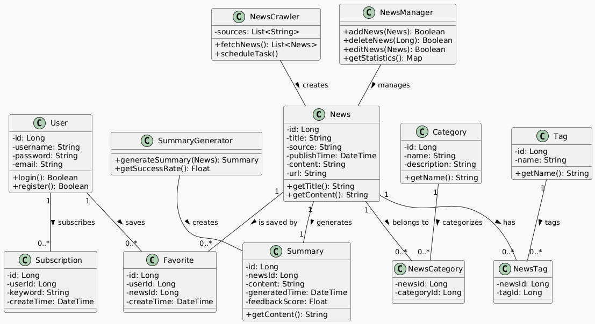
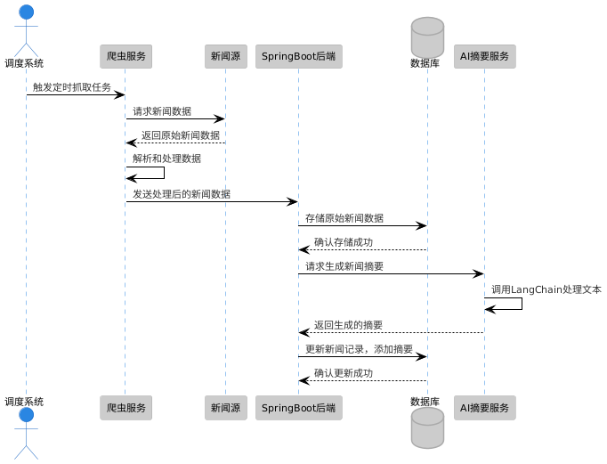
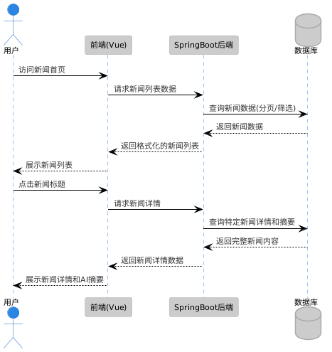
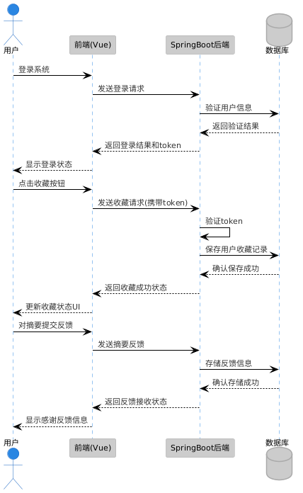
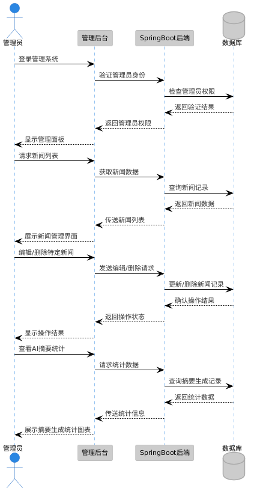

# 阿米News需求文档

## 1. 引言

本文档描述了阿米News的需求，包括系统功能、用户界面、技术要求和其他相关信息。本项目旨在聚合多来源新闻数据，并借助 AI 技术生成新闻摘要，辅助用户快速掌握关键信息，适用于舆情分析、辟谣监控、竞赛信息发布等场景。

## 2. 系统概述

### 2.1 系统用例图

## 3. 功能需求

### 3.1 新闻聚合展示

* 系统能够从多个新闻来源收集新闻数据。
* 抓取内容包括：标题、来源、发布时间、正文、分类、标签等。
* 用户可在首页浏览新闻列表，点击后进入新闻详情页查看完整内容。

### 3.2 新闻分类与标签系统

* 系统支持为新闻打上分类标签。
* 用户可通过标签或分类筛选新闻，提升查找效率。
* 分类和标签应可由管理员维护与新增。

### 3.3 AI 新闻摘要生成

* 系统集成 AI 模块，为每篇新闻自动生成简洁摘要。
* 摘要生成使用大语言模型，由 FastAPI 提供接口服务。
* 在新闻详情页，摘要展示于原文前方，供用户快速预览。

### 3.4 后台管理功能

* 管理员可查看新闻抓取记录、手动编辑/删除新闻内容。
* 管理界面提供分类/标签的维护功能。
* 管理员可查看摘要调用次数与成功率等统计信息。

### 3.5 数据存储与处理

* 所有新闻数据、摘要、标签等信息应存储在后端数据库中。
* 抓取的原始数据与生成的摘要应分离存储，便于调试与更新。
* 数据抓取任务应有调度机制（如定时任务、触发器等）。

### 3.6 用户功能（扩展内容）

* 注册用户可收藏新闻，标记重要新闻或转发链接。
* 用户可对摘要内容进行评分或反馈，优化生成质量。
* 支持关键词订阅推送功能。

## 4. 系统设计

### 4.1 系统流程

下图展示了阿米News系统的主要工作流程，包括新闻爬取、处理、摘要生成以及用户交互过程：

### 4.2 系统类图

以下类图展示了系统的主要实体及其关系：

### 4.3 系统顺序图

以下顺序图展示了系统各组件之间的交互流程和时序关系：

#### 4.3.1 新闻抓取与摘要生成顺序图

下图展示了系统定时抓取新闻数据并生成AI摘要的完整流程：

#### 4.3.2 用户浏览新闻顺序图

下图展示了用户访问系统浏览新闻列表和查看新闻详情的交互流程：

#### 4.3.3 用户收藏和反馈顺序图

下图展示了注册用户登录后收藏新闻和提交摘要反馈的交互流程：

#### 4.3.4 管理员管理新闻顺序图

下图展示了管理员对系统进行新闻管理和查看统计信息的交互流程：

## 5. 技术要求

* **前端**：使用 Vue 构建响应式 Web 界面，支持新闻展示、筛选、详情页等交互。
* **后端**：使用 Spring Boot 构建 RESTful API，实现新闻数据管理、AI摘要接口调用等功能。
* **数据库**：使用 MySQL 或 PostgreSQL 存储新闻、标签、用户数据等结构化信息。
* **AI 模块**：使用 FastAPI 封装摘要生成服务，内部集成 LangChain 调用大模型生成摘要内容。
* **新闻抓取**：模拟爬虫或集成真实开放新闻 API，需具备一定容错与异常处理机制。
* **部署与 DevOps**：

  * 使用 Git 管理项目代码，分支规范开发流程。
  * 项目打包后部署在服务器上。
  * 后端与 AI 模块通过 HTTP 接口通信。
  * 简化性能测试流程，验证摘要响应时间与抓取稳定性。

## 6. 其他要求

* 用户界面应简洁美观，布局合理整洁。
* 系统应具备良好的稳定性，保证抓取与摘要服务的连续可用。
* AI摘要部分应考虑生成质量，具备容错机制。
* 系统应预留接口便于后续扩展，如加入全文搜索、关键词分析、情感分析等高级功能。
* 注意新闻来源合规性与用户数据安全，避免采集敏感信息或未经授权发布内容。

